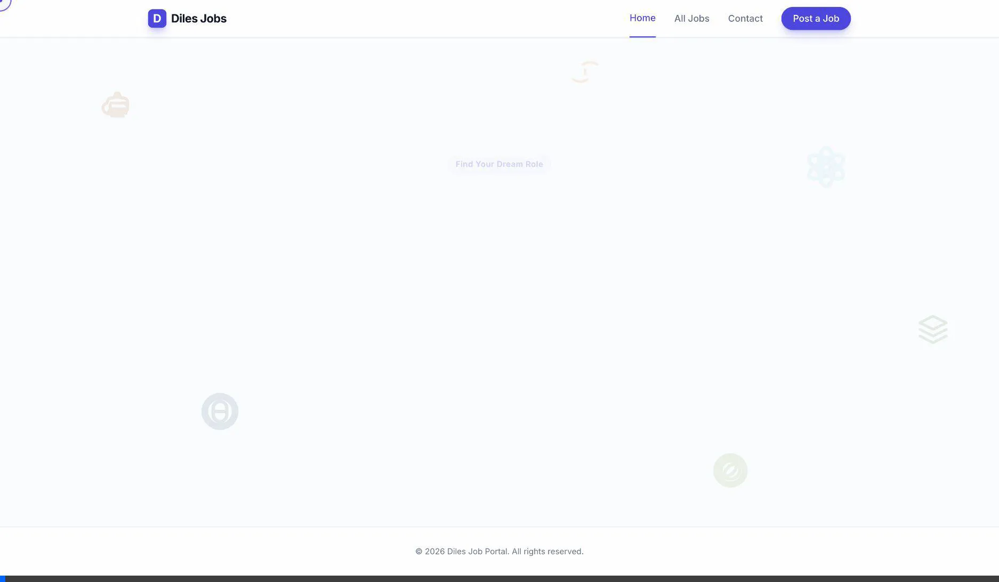

<div align="center">
  <h1>🌌 JobPortal Pro</h1>
  <p>The ultimate destination for premium developers to find their next big leap.</p>

  <!-- Animated Screenshots / Walkthrough -->
  

  <h3>Built With Modern Tech Stack</h3>
  <p>
    
    
    
    
  </p>
</div>

## 📖 What is this?
JobPortal Pro is a state-of-the-art job board application that bridges the gap between top-tier developers and ambitious companies. Powered by **Spring Boot** and **Java**, this platform boasts a radically modern and immersive frontend featuring deep integrations with **Tailwind CSS** and 3D visual effects.

Unlike traditional, rigid enterprise Java applications, JobPortal Pro demonstrates how standard JSP interfaces can be completely reimagined into a premium, fluid, and dynamic user experience—delivering an aesthetic "wow" factor while relying on robust backend technologies.

## ✨ Key Features
- **Ultra-Modern Interface**: Styled with utility-first Tailwind CSS.
- **Micro-Animations & Effects**: Eye-catching backgrounds, typing effects, and smooth route transitions.
- **Interactive Job Listings**: Browse open positions using beautifully structured cards with quick-glance insights and dynamic tech-stack pill selectors.
- **Recruiter Portal**: Managers can seamlessly post new job profiles securely via an elegant form interface.
- **Responsive Design**: Designed gracefully to accommodate mobile, tablet, and ultra-wide monitor screens.

## 🛠️ Technology Stack
- **Backend Core**: Java 21, Spring Boot (WebMVC)
- **View Layer**: JavaServer Pages (JSP) & Tomcat Jasper
- **Frontend Styling**: Tailwind CSS
- **Interactions**: Vanilla JavaScript, GSAP animations
- **Build System**: Maven (featuring Lombok for rapid modeling)

## 🚀 Running the Project Locally

1. **Prerequisites**
   Ensure you have **JDK 21** installed on your workstation.
   
2. **Start the Application**
   Open your terminal in the root directory and run the Maven wrapper:
   ```bash
   ./mvnw spring-boot:run
   ```
   
3. **Explore the App**
   Open your preferred browser (with hardware acceleration enabled to enjoy the 3D features) and navigate to:
   ```
   http://localhost:8080
   ```
   
---
*Note: A complete animated screenshare demo of the app features is embedded at the very top of this repository!*
